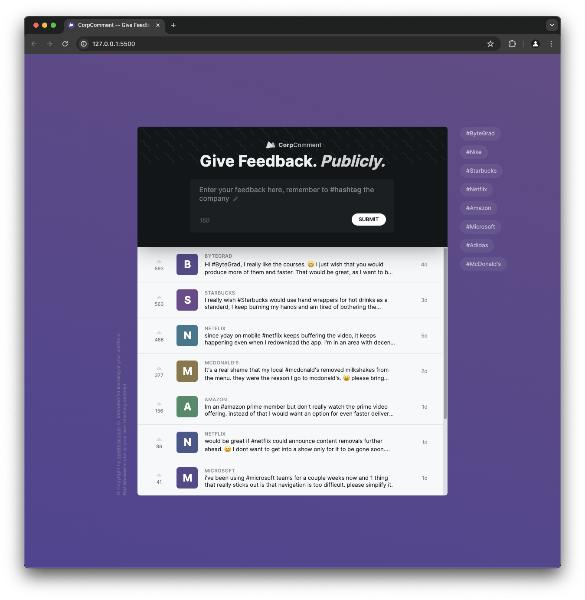

# CorpComment

This project is part of [Byte Grad's](https://bytegrad.com/) Javascript course.

This app is a prototype/practice site that hosts comments to corporations. Users can add feedback as long as they use a hashtag in their comment. Comments can be upvoted.

Data is fetched and sent to a server once you fill in the Base API Url.

## How to Use

Simply pull down the files and open the HTML

## Things to Improve

There are some areas where I think this app can be improved. If I have time, I may go back and add these:

- Accessability. I want to test and make sure this is usable in a variety of scenarios.
- Responsive behavior. There is some, but I think it can handle certain screen sizes better
- You cannot undo an upvote
- You cannot select different hashtags from the filter on the right side once you clicked one; you need to refresh the page to reset the list
